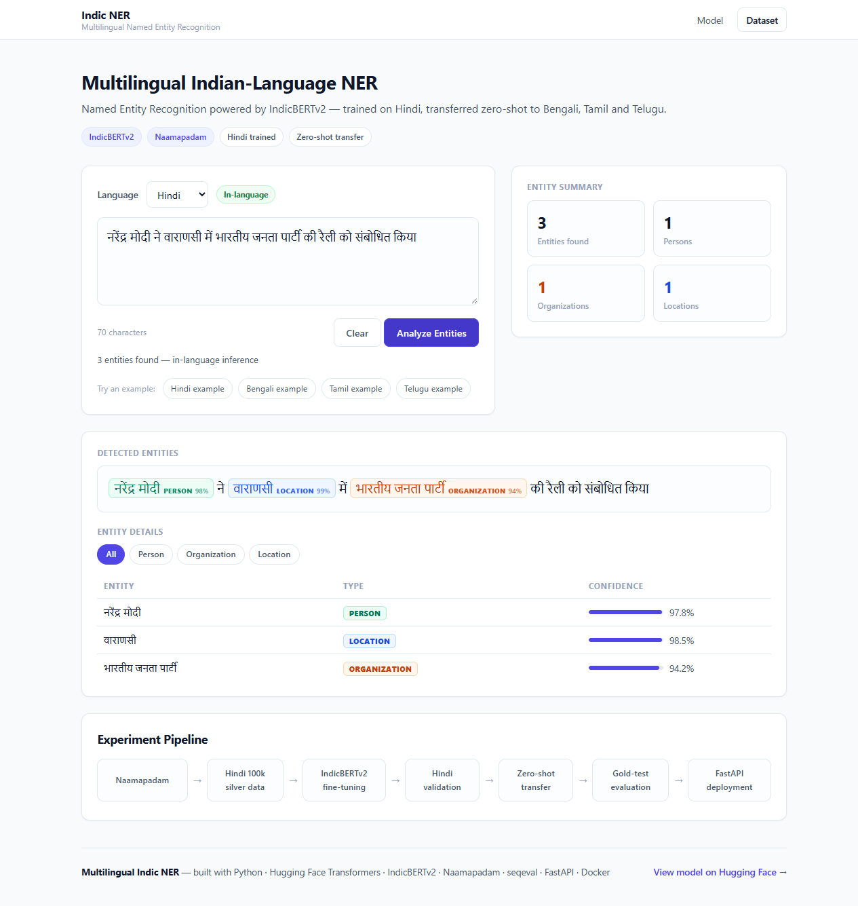

# Multilingual Indic NER



Named Entity Recognition for Indian languages — **IndicBERTv2** fine-tuned on the Hindi portion of [Naamapadam](https://huggingface.co/datasets/ai4bharat/naamapadam), with **zero-shot cross-lingual transfer** to Bengali, Tamil and Telugu.

- Model: [neuronsbyisshu/indicbert-hi-ner-naamapadam](https://huggingface.co/neuronsbyisshu/indicbert-hi-ner-naamapadam)
- Entities: `PERSON`, `ORGANIZATION`, `LOCATION`
- API: FastAPI · UI: built-in single-page app · Deploy: Docker

## Results — official gold test sets (entity-level F1, seqeval)

Training used 100k **silver-standard** (projected) Hindi sentences; final evaluation ran once on the official **manually annotated gold** test sets.

| Language | Setting | F1 | 95% CI (bootstrap) | Test rows |
|---|---|---|---|---|
| Hindi | in-language | **82.74%** | 80.66–84.84 | 867 |
| Bengali | zero-shot | **80.82%** | 77.92–83.42 | 607 |
| Tamil | zero-shot | **75.06%** | 72.35–77.67 | 758 |
| Telugu | zero-shot | **85.31%** | 83.01–87.47 | 847 |

Baseline: BiLSTM-CRF on the same 100k Hindi data — 74.06% entity-F1 (validation).
The model achieves **82.74% F1 on the Hindi gold test set versus 78.00% on the silver validation set**, highlighting a substantial difference between evaluation on projected silver labels and manually annotated gold labels.

## Pipeline

```
Naamapadam → Hindi 100k silver data → IndicBERTv2 fine-tuning → Hindi validation
→ Zero-shot transfer (bn/ta/te) → Gold-test evaluation → FastAPI deployment
```

## Run locally

```bash
pip install torch --index-url https://download.pytorch.org/whl/cpu
pip install -r requirements.txt
uvicorn app.main:app --host 127.0.0.1 --port 8000
```

**Note on PyTorch:** `requirements.txt` intentionally excludes `torch`. It is installed separately so you can pick the right build for your machine — the CPU wheel (command above) keeps Docker images small; any other PyTorch build (e.g. CUDA) also works. Running only `pip install -r requirements.txt` will **not** install a complete runtime.

Open http://localhost:8000 — UI, and http://localhost:8000/docs for the API.

## API

`POST /api/v1/ner`

```json
{"text": "नरेंद्र मोदी ने वाराणसी में भारतीय जनता पार्टी की रैली को संबोधित किया", "language": "hi"}
```

`GET /api/v1/health` · `GET /api/v1/stats`

## Docker

```bash
docker build -t multilingual-indic-ner .
docker run -p 8000:8000 multilingual-indic-ner
```

Every push to `main` builds and pushes `DOCKER_USERNAME/multilingual-indic-ner:latest` to Docker Hub via GitHub Actions (secrets: `DOCKER_USERNAME`, `DOCKER_TOKEN`).

## Evaluation protocol

- Model selection on validation entity-F1 only
- Final gold-test evaluation run once, reported with bootstrap 95% CIs (1000 resamples)
- Error analysis: boundary errors dominate, especially on long (5+ token) organization names; ORG↔LOC is the most frequent type confusion
